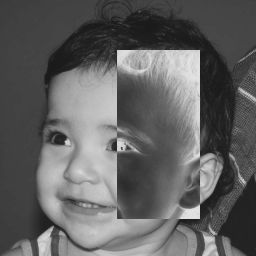

= Processamento Digital de Imagens

== Alunos

Flávio Mata Davim <flaviodavim@gmail.com>

Jonathan Gabriel Lima da Costa <jonathangabriel@bct.ect.ufrn.br>

:sectlinks: true
:sectnums: = true

=== Lista de Exercícios 1

Referente à Primeira Unidade da disciplina de Processamento Digital de Imagens.

==== Questão 1

Utilizando o programa pixels.cpp como referência, implemente um programa regions.cpp. Esse programa deverá solicitar ao usuário as coordenadas de dois pontos  P1 e P2 localizados dentro dos limites do tamanho da imagem e exibir que lhe for fornecida. Entretanto, a região definida pelo retângulo de vértices opostos definidos pelos pontos P1 e P2 será exibida com o negativo da imagem na região correspondente. O efeito é ilustrado na Figura Regiões.

===== Resolução

[source,c++]
----
include::regions.cpp[]
----
==== Questão 2

Utilizando o programa pixels.cpp como referência, implemente um programa trocaregioes.cpp. Seu programa deverão trocar aleatoriamente regiões da imagem, formando uma espécie de quebra-cabeças. Explore o uso da classe Mat e seus construtores para criar as regiões que serão trocadas. O efeito é ilustrado na Figura Troca de regiões.

image::trocaregioes.png[]

===== Resolução

[source,c++]
----
include::trocaregioes.cpp[]
----

==== Questão 3

Observando-se o programa labeling.cpp como exemplo, é possível verificar que caso existam mais de 255 objetos na cena, o processo de rotulação poderá ficar comprometido. Identifique a situação em que isso ocorre e proponha uma solução para este problema.

===== Resolução

Resposta.

==== Questão 4

Aprimore o algoritmo de contagem apresentado para identificar regiões com ou sem buracos internos que existam na cena. Assuma que objetos com mais de um buraco podem existir. Inclua suporte no seu algoritmo para não contar bolhas que tocam as bordas da imagem. Não se pode presumir, a priori, que elas tenham buracos ou não.

image::bolhas.png[]

===== Resolução

[source,c++]
----
include::labeling.cpp[]
----

